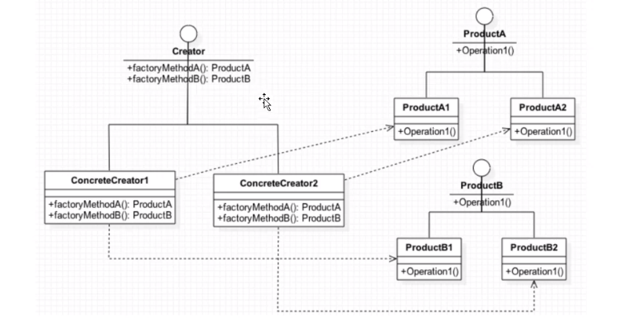
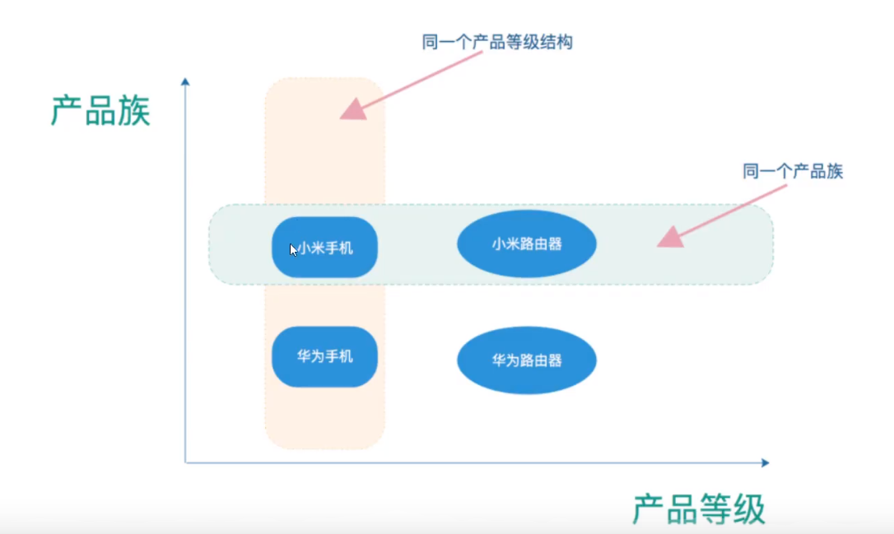

# 抽象工厂模式

### UML类图

### 定义

抽象goon工厂模式提供了一个创建一系列相关或者相互依赖对象的接口，无需指定它们具体的类

### 适用场景

* 客户端（应用层）不依赖于产品类实例如何被创建、实现等细节

* 强调一系列相关的产品对象（属于统一产品族）一起使用创建对象需要大量的重复代码

* 提供一个产品类的库，所有的产品以同样的接口出现，从而使得客户端不依赖于具体的实现

  

### 优点

* 具体产品在应用层的代码隔离，无需关心创建的细节
* 将一个系列的产品统一到一起创建

### 缺点

* 规定了所有可能被创建的产品集合，产品族中扩展新的产品困难；
* 增加了系统的抽象性和理解难度