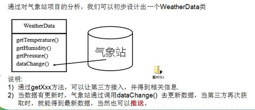
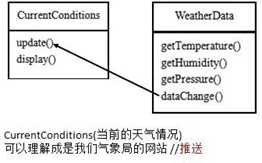
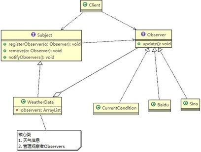

# 观察者模式

### 天气预报项目需求,具体要求如下

1. 气象站可以将每天测量到的温度，湿度，气压等等以公告的形式发布出去(比如发布到自己的网站或第三方)。

2. 需要设计开放型 **API**，便于其他第三方也能接入气象站获取数据。

3. 提供温度、气压和湿度的接口

4. 测量数据更新时，要能实时的通知给第三方

   

### 天气预报设计方案 1-普通方案

#### 问题分析

1. 其他第三方接入气象站获取数据的问题
2. 无法在运行时动态添加第三方
3. 违反ocp原则：在 WeatherData 中，当增加一个第三方，都需要创建一个对应的第三方对象，并加入到 dataChange, 不利于维护，也不是动态加入

### 观察者模式原理

1. 观察者模式类似订牛奶业务

2. 奶站/气象局：Subject

3. 用户/第三方网站：Observer

   

* Subject：登记注册、移除和通知

  * registerObserver() 注册

  * removeObserver() 移除

  * notifyObservers() 通知所有的注册的用户，根据不同需求，可以是更新数据，让用户来取，也可能是实施推送， 看具体需求定

* Observer：接收输入

* **观察者模式**：对象之间多对一依赖的一种设计方案，被依赖的对象为 Subject，依赖的对象为 Observer，Subject通知 Observer 变化,比如这里的奶站是 Subject，是 1 的一方。用户时 Observer，是多的一方。

### 观察者模式解决天气预报需求

